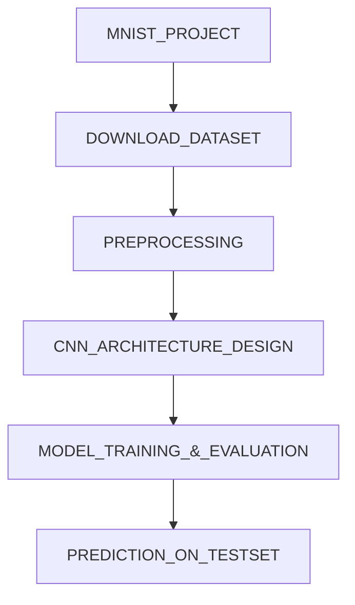

# MNIST Digit Recognition with Convolutional Neural Networks (CNN)

This repository contains code for training and evaluating a Convolutional Neural Network (CNN) model on the MNIST dataset to classify handwritten digits. The code is implemented using PyTorch, a popular deep learning framework.

## MNIST Dataset

The MNIST dataset is a widely used benchmark dataset in the field of machine learning. It consists of a training set of 60,000 grayscale images of handwritten digits from 0 to 9, and a test set of 10,000 images. Each image is 28x28 pixels.

## Requirements

To run the code, you need to have the following dependencies installed:

- Python 3.x
- PyTorch
- torchvision
- NumPy
- Matplotlib





## Model Architecture

### Key Features:

CNN Architecture: The project utilizes a meticulously designed CNN architecture comprising convolutional layers, pooling layers, and fully connected layers. This architecture enables the model to extract intricate features from digit images, facilitating accurate classification.

The CNN model used in this code consists of two convolutional layers followed by fully connected layers. The architecture is as follows:
```

CNN (
  (L1): Sequential(
    (0): Conv2d(1, 32, kernel_size=(3, 3), stride=(1, 1), padding=(1, 1))
    (1): ReLU()
    (2): MaxPool2d(kernel_size=2, stride=2, padding=0, dilation=1, ceil_mode=False)
  )
  (L2): Sequential(
    (0): Conv2d(32, 64, kernel_size=(3, 3), stride=(1, 1), padding=(1, 1))
    (1): ReLU()
    (2): MaxPool2d(kernel_size=2, stride=2, padding=0, dilation=1, ceil_mode=False)
  )
  (L3): Linear(in_features=3136, out_features=1000, bias=True)
  (L4): Linear(in_features=1000, out_features=100, bias=True)
  (L5): Linear(in_features=100, out_features=10, bias=True)
)

```


Data Preprocessing: The project employs essential data preprocessing techniques such as normalization and resizing to ensure optimal compatibility with the CNN model, enhancing its overall performance.


Model Training and Evaluation: The model undergoes rigorous training using the MNIST training dataset and is evaluated using the MNIST testing dataset. This evaluation process provides crucial insights into the model's performance metrics, including accuracy, precision, and recall.


## Results

The trained model achieves high accuracy on the MNIST test set, as indicated by the accuracy plot.

Accuracy while training:


Acurracy for test set :

